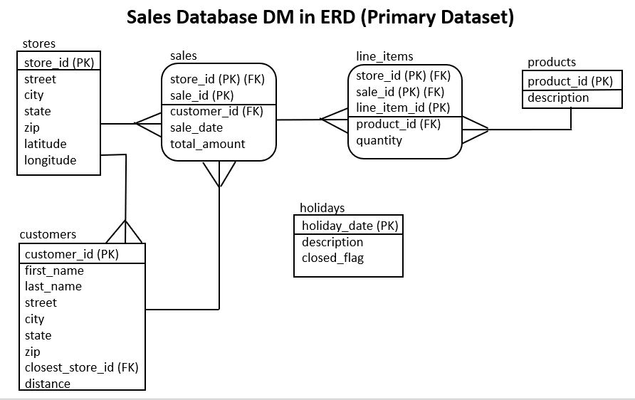
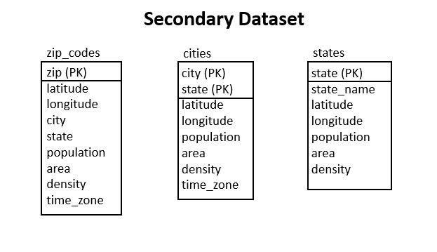

# Sales Database Physical Data Model (DM) in Entity-Relationship Diagram (ERD) notation and Data Dictionary

### How to read ERD notation

Data Models come in 3 main types: Conceptual, Logical, and Physical.   The Physical Data Model is used by programmers, so that is what is provided above.

ERD notation can be much more complex than the model presented above.  Since most students are new to ERDs, we have provided the minimum ERD notation to convey the meaning needed for this course and especially for project 1.

Here are the basics of ERD notation:
* Each box is a table with the table name written above the box
* If any foreign key is part of the primary key, we use rounded corners on the box
* Inside each box is a list of columns in the table
* Columns that are part of the primary key are above the line and also have (PK) after them
* Columns that are foreign keys have (FK) after them.  When joining, join the foreign key to the primary key in the parent table
* Relationships between tables are denoted using the crow's foot notation.  The line touches the parent table.  The crow's foot touches the child table. 
* Dangerous joins are joins between tables not based on matching a foreign key to a primary key.  They are often necessary, but be careful, as they can cause the "extra rows" problem or the "missing rows" problem.
* When loading data, parent rows must be loaded prior to child rows, otherwise the database will generate a foreign key violation error
* When deleting data, child rows must be deleted before parent rows can be deleted, otherwise the database will generate a foreign key violation error

We can read relationships as follows:
* A store may have many sales
* A store may have many customers
* A customer may have many sales
* A sale may have many line items
* A product may have many line items

A good memory aid is the crows foot:  the many side has many lines.

### Primary versus Secondary Datasets

Outside of AI, Data Science, Business Intelligence, Data Analytics, etc. most database queries are strictly done using a primary dataset using a DM in 3NF (3rd Normal Form).  

However, in AI, Data Science, Business Intelligence, Data Analytics, etc., it's very common to enhance our analytics using one or more secondary datasets.  In our database, we have a secondary dataset consisting of zip_codes, cities, and states.  From these tables, we can enhance our primary dataset, brining in such additional information as population, density, time_zone, etc.  

Part of w205, especially project 1, is to get students some experience with using secondary datasets to enhance the primary datasets.

Secondary datasets are often denormalized, that is they are not properly modeled in 3NF.  They typically contain redundant data and typically don't have relationships between tables.  Our secondary dataset was setup this way on purpose to give you some experience with this.

All joins between a primary dataset and a secondary dataset where relationships are not defined are classified as dangerous joins.  Even though they are dangerous joins, they are necessary, but should be approached with caution.

### Assume a clean dataset

For this sales dataset, assume the dataset has been through a cleansing process before loading.  

In project 2, we will cover dirty data and data cleansing techniques for a 3rd party sales load.

### Data Dictionary

The data dictionary gives us more details about each table, including the datatype, size, description, etc., plus any additional notes that allow us to understand the data better.

#### stores

* store_id (PK) numeric(6) - unique id number for each store
* street varchar(32) - street part of the address: number, street name, street suffix, etc.
* city varchar(32) - city
* state varchar(2) - 2 letter US Post Office abbreviation for the state
* zip varchar(5) - 5 didgit zip code assigned by the US Post Office
* latitude numeric(7,4) - latitude in decimal format
* longitude numeric(7,4) - longitude in decimal format

store_id is the primary key

latitude and longitude are stored in decimal format, which is preferred for computers.  Non-computer applications might specify using a direction, degrees, minutes, seconds, etc.

It is possible to have a new store without any sales yet.

#### customers

* customer_id (PK) numeric(6) - unique compute generated id for each customer
* first_name varchar(32) - customer's first name (fictitious)
* last_name varchar(32) - customer's last name (fictitious)
* street varchar(32) - street part of the address: number, street name, street suffix, etc. (fictitious)
* city varchar(32) - city
* state varchar(2) - 2 letter US Post Office abbreviation for the state
* zip varchar(5) - 5 didgit zip code assigned by the US Post Office
* closest_store_id (FK) numeric(6) - closest store to the customer and generally the main store the customer would shop at, however, customers might shop at other stores
* distance numeric(3) - distance of the customer's zip code center to the store

The customer_id is the primary key 

first_name and last_name are fictitious from a data generating program due to privacy laws and ethical concerns

street is fictitious from a data generating program due to privacy laws and ethical concerns (they will not show up as valid if you try to validate them using Google address API or similar)

city, state, and zip are valid and can be validated against the zip_code table in the secondary database

closest_store_id is a foreign key to the store table and should be joined to store_id

It is possible to have a new customer without any sales yet

#### products

* product_id (PK) numeric(3) - unique id number for each product
* description varchar(32) - description of the product

product_id is the primary key

All products cost $12, tax exempt due to food items (or tax included) to simplify the scenario.

It is possible to have a new product without any sales yet

#### holidays

* holiday_date (PK) date - date of the holiday
* description varchar(32) - description of the holiday
* closed_flag boolean - True if stores are closed, False if open
  
holiday_date is the natural primary key

#### sales

* store_id (PK) (FK) numeric(6) - store that made this sale
* sale_id (PK) numeric(8) - computer generated id for this sale, unique only within a store
* customer_id (FK) numeric(6) - customer who bought this sale
* sale_date date - date of the sale
* total_amount numeric(5) - total dollar amount of the sale

store_id, sale_id is a composite primary key 

customer_id is a foreign key to the customer table and should be joined to customer_id

total_amount is ($12 * number of meals purchased), assuming no sales tax on food.  total_amount has been validated against the sum of quantities in the line items

It is not possible to have a sale without a store and a customer

#### line_items

* store_id (PK) (FK) numeric(6) - store that made this sale
* sale_id (PK) (FK) numeric(8) - computer generated id for this sale, unique only within a store
* line_item_id (PK) numeric(3) - computer generated line item id for this sale, unique only within a store and a sale
* product_id (FK) numeric(3) - product that was purchased
* quantity numeric(3) - quantity of the product that was purchased

store_id, sale_id, line_item_id is a composite primary key

product_id is a foreign key that maps to the product table and should be joined on product_id

It is not possible to have a line item without a sale and a product

#### zip_codes

* zip (PK) varchar(5) - official US Postal Service zip code 
* latitude numeric(7,4) - latitude in decimal format
* longitude numeric(7,4) - longitude in decimal format
* city varchar(32) - city
* state varchar(2) - 2 letter US Post Office abbreviation for the statenearest zip code with population
* population numeric(7) - number of people who live in that zip code 
* area numeric(9,4) - area in square miles
* density numeric(10,2) - population density in terms of number of people per square mile for the zip code
* time_zone varchar(32) - time zone in official ICANN "tz database" format

zip is the natural primary key

latitude and longitude are stored in decimal format, which is preferred for computers.  Non-computer applications might specify using a direction, degrees, minutes, seconds, etc.

We have limited our data to zip codes with population.  There are zip codes that don't have population. They are special zip codes for things like credit card companies that receive a lot of mail, some military and government facilites, etc.

The source of population, area, and density are from the US Postal Service.  Population can vary from population estimates from other government agencies. Each agency has its own estimates.  Area and density generally exclude things like water, uninhabited terrain, etc.  Other sources may include these.

time_zone uses a name from the official ICANN "tz database".  Computer systems use the tz database, including AWS, Linux, etc. to specify time zones. 

#### cities

* city (PK) varchar(32) - city
* state (PK) varchar(2) - 2 letter US Post Office abbreviation for the state
* latitude numeric(7,4) - latitude in decimal format
* longitude numeric(7,4) - longitude in decimal format
* population numeric(9) - number of people who live in that city
* area numeric(10,4) - area in square miles
* density numeric(10,2) - population density in terms of number of people per square mile for the city
* time_zone varchar(32) - time zone in official ICANN "tz database" format

city, state is the natural composite primary key.  city is not unique by itself, as many states have cities with the same name

latitude and longitude are stored in decimal format, which is preferred for computers.  Non-computer applications might specify using a direction, degrees, minutes, seconds, etc.  It is for the geographic center of the city.

The source of population, area, and density are from the US Postal Service.  Population can vary from population estimates from other government agencies. Each agency has its own estimates.  Area and density generally exclude things like water, uninhabited terrain, etc.  Other sources may include these.

time_zone uses a name from the official ICANN "tz database".  Computer systems use the tz database, including AWS, Linux, etc. to specify time zones. 

#### states

* state (PK) varchar(2) - 2 letter US Post Office abbreviation for the state
* state_name varchar(32) - official name of the state
* latitude numeric(7,4) - latitude in decimal format
* longitude numeric(7,4) - longitude in decimal format
* population numeric(10) - number of people who live in that state
* area numeric(10,4) - area in square miles for the state
* density numeric(10,2) - population density in terms of number of people per square mile for the state

state is the natural primary key

latitude and longitude are stored in decimal format, which is preferred for computers.  Non-computer applications might specify using a direction, degrees, minutes, seconds, etc.  It is for the geographic center of the state.

The source of population, area, and density are from the US Postal Service.  Population can vary from population estimates from other government agencies. Each agency has its own estimates.  Area and density generally exclude things like water, uninhabited terrain, etc.  Other sources may include these.

  
