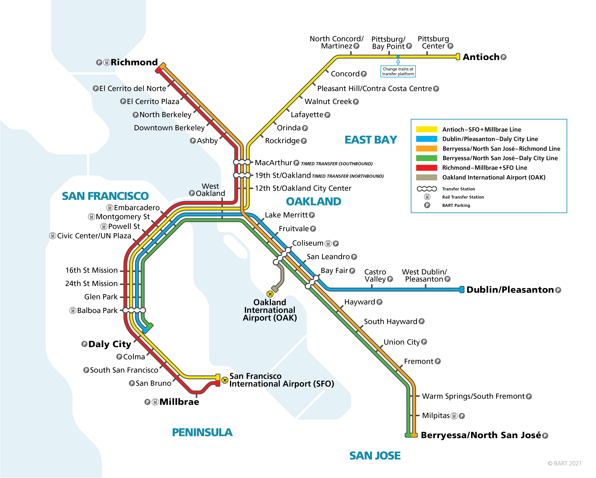

# Moved to bCourses - all of the content in this page has been moved to bCourses, and as of April 15, 2022, is no longer being updated.  Please use bCourses for the most recent, up to date version. This repo will be deleted once we are sure we have moved everything to bCourses correctly.

# Additionally - we are going to be making substantial changes to project 3 based on feedback from students from the Spring 2022 semester.  Please wait until the new version of this project is given before starting on it.

# Project 3 Instructions

## Labs 8, 9, and 10

This project has two parts: a coding part and a presentation part.  

After completing labs 8 and 9, you will have everything you need to complete the coding part.  If you have not completed labs 8 and 9, the instructions for the coding part won't make much sense.

After completing lab 10, you will have everything you need to complete the presentation part.  If you had not completed lab 10, the instructions for the presentation part won't make much sense.

## Group project

Project 3 will be a group project:
* Groups of 3 students
* Students select their group members
* In the case where the number of students does not evenly divide 3, the instructor will decide how to handle the situation.

All group members must contribute:
* Equally in terms of time
* Equally in terms of effort

All group members must communicate in a timely manner with other group members:
* Slack should be used for communications
* Students should try to respond as soon as possible to group members, even if it's to say they need more time to respond
* If a student has not responded within 24 hours, the group members should ping them again
* If a student has not responded within 48 hours, the group members should ping them again
* If a student has not responded within 72 hours, and 3 contact attempts have been made, the group members should let their instructor know and their instructor will ping the student
* The instructor may impose a penalty of up to 10 points on either or both of the coding part and/or the presentation part for refusing to communicate with group members and/or their instructor in a timely manner

The project will consist of 2 parts:
* A coding part
  * Due week 13, on the day of your class meeting, at 11:59 pm Pacific
  * 15 percent of the semester letter grade
  * Objective - right or wrong
  * GitHub repo (1 repo per group)
* A presentation part
  * Presented in class week 14 during your class meeting
  * 15 percent of the semester letter grade
  * Subjective - opinions supported by data and/or data visualizations
  * Use slack to send your presentation materials to your instructor

Peer reviews:
* Student will rank the contribution in terms of time, effort, and timely communication of their other group members
  * Instructors may impose a penalty of up to 10 points on either or both of the coding part and/or the presentation part for students who contributed substantially less than the other group members
* Students will rank the presentations in their section
  * Instructors will take the student peer review ranking into account when grading the presentation

Extensions:
* Since we are up against a hard deadline of grades due in Cal Central the last week of classes, extensions will only be possible in extreme circumstances with verifiable documentation
* If you ask for an extension, you must agree to an incomplete for the course.  Please note that you cannot take any course that w205 is a prerequisite for until the incomplete has been cleared, and incompletes may take several weeks to clear once your instructor turns in the paperwork.  There is nothing your instructor can do to speed up this process.

Group Issues:

Just like the real world, group issues can arise.  In the real world, managers value teams that have the leadership skills to work out issues among themselves.  Likewise, instructors value students with leadership skills to solve issues without involving the instructor.

Remember that when an issue arises, you have two options:
* Be part of the problem by just complaining about it
* Be part of the solution by taking a leadership role to solve it

Most times when group issues arise, students are pointing the finger at one student who is behind or has not completed tasks.  On closer examination, it's often the case that it's the entire group's fault for starting the project late, and they are simply looking for a scapegoat rather than taking personal responsibility for starting the project late.

Here are some suggestions to avoid group issues:
* Start the project the week it is assigned, don't wait!
* Frequently communicate with team members; give and ask for updates every 1 or 2 days to ensure things are on track
* Try to find the best fit of tasks to group members' skill levels and interests
* Evenly share the fun tasks and the not so fun tasks
* Evenly share the easy tasks and the difficult tasks
* If a group member is having difficulty completing a task, other members should offer to assist them to complete the task
* If needed, swap out tasks to relieve group members of tasks they are struggling with for tasks they can succeed at

If you feel you cannot work out a group issue within the group and need an instructor intervention, be prepared to provide documentation that includes:
* Date the group started on the project and first assigned tasks
* Trail of frequent communications, with updates every 1 or 2 days
* Offers to help the group member complete their tasks
* Offers to swap the group member's task with another task
* Requests for instructor interventions need to be made at least 10 days prior to a due date, otherwise, there isn't much an instructor can do to rectify the situation in time for the deadline.

## Additional Experience

In this project, you will gain additional experience with:
* GitHub on the Linux command line, including branches, pull requests, etc.
* SQL queries
* Functional programming using Python and SQL
* Linux command line
* Cloud (AWS)
* VM in the cloud instead of a physical computer
* Cluster of Docker containers running inside a VM in the cloud
* Enhancing a primary dataset with a secondary dataset
* Creating database tables
* Loading CSV files into database tables

## New Skills

In this project, you will gain new skills:
* Creating a NoSQL graph database in Neo4j
* Functional programming using Python and Cypher
* Writing Python code to pull data using SQL and insert nodes and relationships into Neo4j using Cypher
* Compare and contrast graphs stored in SQL with NoSQL
* Writing Python code to run graph algorithms and wrangle the results
* Using geodesic distances
* Understanding how the NoSQL document database MongoDB can be useful
* Understanding how the NoSQL in-memory key-value store database Redis can be useful


## BART Map



## Business Case Scenario

Assume you are a full stack data scientist at Acme Gourmet Meals (AGM).

AGM executives have heard of some new futuristic delivery and pickup options that they want to investigate at a preliminary level:
* Adding more pickup locations
* Using public transportation to transport deliveries
* Using delivery drones
* Using delivery robots
* A hybrid approach of any combination of these options

**Berkeley store, San Francisco Bay Area, BART**

For this investigation, the executives only want you to expore the Berkeley store, the San Francisco Bay Area, and BART.

**Adding more pickup locations**

Adding more pickup locations is generally considered an easy way to grow the customer base and grow the frequency that customers purchase meals.

Creating a pickup location requires renting (or purchasing) property, renovating (or building) space in a way suitable for the business.

Since the executives would be considering longer term leases (or purchases) with expensive renovation (or building), they want to see if they can future proof their location choices.

Locations at or near BART stations would be good choices because BART riders could easily pick up meals at the stations they travel through on the way to or from work.  Most would probably pick them up on the way home, but if they have refrigerators at work, some may pick them up on the way to work.

**Using public transportation to transport deliveries**

Using public transportation to transport deliveries has been used in some areas for a long time, such as the Dabbawalas in Mumbai, India, which started in the late 1800's.

In the US, informal use of public transportation has been used for messenger and delivery services in some of the larger cities.

Most large cities are starting to explore allowing organized, wide spread use of public transportation for deliveries.  Some proposals even allow for special train cars, or even special trains, strictly for delivery.

The executives want to future proof their decision on adding pickup locations to be able to take advantage of using BART to transport deliveries in the future.

**Using delivery drones**

The executives want to future proof their decision on adding pickup locations to be able to take advantage of adding delivery drones in the future.

**Using delivery robots**

The executives want to future proof their decision on adding pickup locations to be able to take advantage of adding delivery robots in the future.

**Hybrid approach**

The executives want to explore some hybrid approaches that might be possible, such as:
* Using BART to transport deliveries to various pickup locations near BART stations where customers can pickup their meals
* Using BART to transport deliveries to traditional manned delivery trucks 
* Using BART to transport deliveries to delivery drones 
* Using BART to transport deliveries to delivery robots 

**Using NoSQL databases**

So far the IT department only has SQL based traditional relational databases.  Your data science manager has discussed with the executives bringing in NoSQL databases in the cases where it makes more sense than a SQL based relational database.

The IT department has created a traditional relational data model, in Third Normal Form, 3NF, for the BART system:
* **stations** table with each station name, latitude-longitude, and average transfer time in seconds
* **lines** table with each line by color, with the sequence of stations going one way (trains move both ways, but in keeping with 3NF, they only store it one way)
* **travel_times** table with station_1, station_2, and the average travel time in seconds between then.  station_1 is alphabetically less than station_2 (trains move both ways, but in keeping with 3NF, they only store it one way).  All lines between the same two stations have the same average travel time.

The IT department has provided us with CSV files of these tables.

A NoSQL graph database such as Neo4j would be a logical choice to analyze a system such as BART.  The executives would like to hear about the differences between using a traditional SQL relational database to store graphs and using Neo4j.

The executives would also like some suggestions on how a NoSQL document store such as MongoDB and/or a NoSQL in-memory key-value store such as Redis might be used in future systems related to the hybrid deliveries.

# Following this is a section for the "Coding Part" and a section following that for the "Presentation Part"

Please ensure you read the entire instructions!

## Coding Part

The coding part is due in week 13, on the day of your class meeting, at 11:59 pm.

The coding part will help you to develop some tools that you will find useful for your analysis for your presentation.

In part 3.1, you will create and load the stations, lines, and travel_times tables for the BART system that we received from the IT department.

In part 3.2, you will create some queries on the stations, lines, and travel_times tables for the BART system that we will use later to create the graph.

In part 3.3, you will create a graph database in Neo4j for the BART system from the queries in part 3.2.  This graph will allow you to do further analysis on the BART system, paths, centrality, etc.

In part 3.4, you will verify the graph database in Neo4j for the BART system.  You will run some shortest paths and verify that they are correct to help verify that you have created the graph correctly.

In part 3.5, you will use geodesic distances and zip code and population data to enhance our BART model.  For a station, you can find all the zip codes within X miles, the population of each zip code, and the total population.  This will allow you to analyze how much population is within a BART station area, how much population a delivery drone could service, how much population a delivery robot could service, etc.

**Coding Part: Coding Guidelines**

You may freely use any code from the labs.  You do not have to cite code from the labs.

For the remainder of the code, you need to write your own.  

You are allowed to look at example code from other sources.  If it's a trivial snippet of code, that would be too small to rewrite, it's fine to use it.  If it's non-trivial code, you will need to rewrite the example code to make it your own.

You **MUST** code using functional programming using Python, Pandas, SQL, and Cypher.  Review week 1 if you are unsure of what functional programming is.  It must be Python calling a module or package (API) for software running in Docker in your VM in AWS.

The code written for 205 should be considered prototype quality.  It does not have to be production quality code. The idea is that you are creating ad hoc analytics, and later whatever you want to keep, you will convert to production quality.  There are no set coding standards, as long as you code is reasonably readable. SQL queries should have some simple formatting, such as was done in the labs. You can code for the "happy path", assuming everything goes right.  You do NOT have to code exception conditions.  The idea is for you to focus more on the analytics rather than making code production quality.

### Coding Part: GitHub Procedures

**Create a private repo (Create only 1 repo per group!)**

Note: this procedure only needs to be once.

Create only 1 repo per group!

Following the same procedures as was done in projects 1 and 2, create a private repo in GitHub.

Please name your repo **ucb_mids_w205_project_3** so the grading scripts can download your repo correctly for grading.

**Grant collaborator access to instructor and grading pool (at least 2 weeks prior to due date!)**

Note: this procedure only needs to be done once.

This procedure needs to be done at least 2 weeks prior to the due date.  Instructors generally check emails every few days to accept the collaborator requests.  

Grant collaborator access to your instructor and to the grading pool.  The instructor GitHub username and grading pool username will be provided in the datasci-205 slack channel. 

Follow the same procedures as was done in projects 1 and 2.

**Enter a link to your repo into the Google form (at least 2 weeks prior to the due date!)**

Note: this procedure only needs to be done once.

Enter only 1 link per group - whoever created the repo should enter the link!

This procedure needs to be done at least 2 weeks prior to the due date.

You will need to enter a link to your repo into a Google form.  This will allow us to run the grading scripts to pull your repo. 

Follow the same procedures as was done in projects 1 and 2.

[Google form to enter the link to your GitHub repo](https://forms.gle/Xy766NsF76MeY6K16)

**Clone you repo to the VM, create a branch, check out the branch, download the CSV files and Jupyter Notebooks (at least 2 weeks prior to the due date!)**

Note: this procedure only needs to be done once.

Follow the same procedures as was done in projects 1 and 2.

Change to the projects directory:
```
cd ~/user/projects

```

Clone the repo:
```
git clone xxxxx

```

Change to the repo directory:
```
cd ucb_mids_w205_project_3

```

Show the status of the repo.  You will use this command numerous times:
```
git status

```

Create a branch called **project**.  Please use this exact name so the autograding scripts can find your branch!
```
git branch project

```

Checkout the project branch:
```
git checkout project

```

Verify that you are on the project branch:
```
git status

```

Download the CSV files and starter Jupyter Notebooks:
```
curl -o stations.csv https://raw.githubusercontent.com/kevin-crook-ucb/ucb_mids_w205_repo/main/projects/project_3/stations.csv
curl -o lines.csv https://raw.githubusercontent.com/kevin-crook-ucb/ucb_mids_w205_repo/main/projects/project_3/lines.csv
curl -o travel_times.csv https://raw.githubusercontent.com/kevin-crook-ucb/ucb_mids_w205_repo/main/projects/project_3/travel_times.csv

curl -o project_3_1.ipynb https://raw.githubusercontent.com/kevin-crook-ucb/ucb_mids_w205_repo/main/projects/project_3/project_3_1.ipynb
curl -o project_3_2.ipynb https://raw.githubusercontent.com/kevin-crook-ucb/ucb_mids_w205_repo/main/projects/project_3/project_3_2.ipynb
curl -o project_3_3.ipynb https://raw.githubusercontent.com/kevin-crook-ucb/ucb_mids_w205_repo/main/projects/project_3/project_3_3.ipynb
curl -o project_3_4.ipynb https://raw.githubusercontent.com/kevin-crook-ucb/ucb_mids_w205_repo/main/projects/project_3/project_3_4.ipynb
curl -o project_3_5.ipynb https://raw.githubusercontent.com/kevin-crook-ucb/ucb_mids_w205_repo/main/projects/project_3/project_3_5.ipynb

```

Verify the Jupyter Notebooks downloaded correctly:
```
ls -l

```

Verify that the Jupyter Notebooks have been detected in the repo:
```
git status

```

**Stage files, commit files, push to GitHub (first initial stage, commit, and push needs to be done at least 2 weeks prior to due date!)**

Note: this procedure will be done numerous times.  Everytime you complete a logical unit of work, say every couple or hours, you will want to stage, commit, and push to save your work to GitHub.  Remember "stage, commit, and push: early and often".

The first initial stage, commit, and push needs to be done at least 2 weeks prior to the due date.

Follow the same procedures as was done in projects 1 and 2.

Do NOT stage any unnecessary files.  Follow the commands given below.  Do NOT do a "git add * " as it will add unnecessary files.  

Stage the JSON file and the Jupyter Notebooks:
```
git add stations.csv
git add lines.csv
git add travel_times.csv

git add project_3_1.ipynb 
git add project_3_2.ipynb
git add project_3_3.ipynb
git add project_3_4.ipynb
git add project_3_5.ipynb

```

Verify the staging:
```
git status

```

Commit the staged files:
```
git commit -m "updates"

```

Verify the commit:
```
git status

```

Push the local commit on the branch up to GitHub.  Since it's a :
```
git push origin project

```

Using the GitHub web interface in your browser, verify the branch push worked and all files are present.

**When you are finished, turn in the project by creating a pull request**

Note: this procedure only needs to be done once.

Follow the same process as was done in projects 1 and 2 to create a pull request that compares the project branch to the main branch with the grading pool as a reviewer.   

Note that you cannot add a reviewer unless they have accepted your collaborator request.  Please be sure and send out your collaborator request at least 2 weeks prior to the due date to allow them to accept.

### Coding Part: Docker and Jupyter Notebook Procedures

Follow the instructions for the lab for week 9: start the Docker cluster, start the Jupyter Notebook server in the Anaconda container, and connect the web browser to the Jupyter Notebook server.  Navigate to the project directory you cloned above and open the Jupyter Notebooks.  The Jupyter Notebooks include further specific instructions.

### Coding Part: Grading Rubrics

Semester Weighting
* Project Coding Part
  * 15 percent
  * Objective - right or wrong
  * Graded 0 to 100

GitHub deadlines
* Maximum deduction for GitHub deadlines: -3
* Created the repo less than 1 week prior to the coding part deadline, penalty -1
* Granted collaborator access to instructor and grading pool less than 1 week prior to the coding part deadline, penalty -1
* Entered a link to your repo into the Google form less than 1 week prior to the coding part deadline (note: only the student who created the repo should enter the link), penalty -1
* Cloned your repo to the VM, created a branch, checked out the branch, and downloaded the CSV files and Jupyter Notebooks less than 1 week prior to the coding part deadline, penalty -1
* Your first initial stage, commit, and push was less than 1 week prior to the coding deadline, penalty -1

Late Submissions
* For project 3, no late submissions can be accepted to allow us to grade in time for grades due in Cal Central

GitHub procedures
* Maximum deduction for GitHub procedures: -3
* Did not name the repo the name given in proper case, penalty -1
* Did not name the branch the name given in proper case, penalty -1
* Altered the main branch, penalty -1
* Did not name the Jupyter Notebooks the names given in proper case, penalty -1
* Non-essential files were checked in, such as checkpoint files and directories, penalty -1
* Did not check in the file lines.csv, penalty -1
* Did not check in the file stations.csv, penalty -1
* Did not check in the file travel_times.csv, penalty -1
* More than 1 open pull reqeust, penalty -1

Parts 3.1, 3.2, 3.3, 3.5
* Provided an answer that was absolutely correct, with no imperfections, no penalty
* Provided an answer that was partially correct, penalty -1
* Provided an answer that was wrong, penalty -2
* Did not provide an answer, penalty -3

Part 3.4: 

Since these questions verify that the graph is correct, and since correctness of the graph is crucial to this project, no partial credit will be given.  

The expected output is provided for each question.  Ensure your output matches, with the exceptions noted for paths with identical costs.  
* Provided an answer that was absolutely correct, with no imperfections, no penalty 
* Otherwise, penalty -3

Communication issues:
* At detailed previously, the instructor may impose a penalty of up to 10 points on the coding part for refusing to communicate with group members and/or their instructor in a timely manner

Time and effort issues:
* Instructors may impose a penalty of up to 10 points on the coding part for students who contributed substantially less than the other group members

## Presentation Part

Your group will create a presentation:
* Presented during class on week 14
* All group members need to be part of the presentation
* Target 12 minutes, plus or minus 2 minutes
* You may present as few or as many slides as you wish, whatever you think works best within time constraints
* The audience for your presentation should be executives who are familiar with basic, high level IT concepts, but not necessarily IT people

Deliveries:
* A single PDF file of your slides 
* A zip file of any additional Jupyter Notebooks that you created in addition to the coding part
* Submit by a direct message in slack
* Due at the start of your class meeting in week 14. 

The slides can be created using any tool or tools, as long as you can produce a single PDF file to submit.

The slides should have a consistent look and feel, and the entire presentation should flow.  It should NOT look like 3 students worked independently and merged them together into a single file a couple of days before the presentation. (We get this a lot with group presentations)  You may find it helpful for one student to be given the task of editor and have them ensure all slides have the same look, feel, and overall flow.

Data visualizations are not required, but are probably a good idea to make your presentation better.  Unlike projects 1 and 2, data visualizations can be created using any tool, even desktop tools, or tools external to the VM.  

All group members need to be part of the presentation.  There is no requirement that group members present evenly, just that everyone presents a part.

The additional Jupyter Notebooks can be in extremely raw, experimental form.  No titling needed, no formatting needed, etc.  The instructor will not look at these in detail.  They will only be looked at if there is a serious question about some of the data and/or data visualizations presented in the PDF slides, and your instructor will probably ask you to point out the relevant code.

Your presentation should cover the following details:
* Limit your discussion to the Berkeley store, San Francisco Bay Area, BART
* Adding more pickup locations
* Using public transportation (BART) to transport deliveries
* Using delivery drones
* Using delivery robots
* A hybrid approach of any combination of these
* NoSQL
  * Briefly compare and contrast using Neo4j versus SQL relational database tables
  * Briefly describe possible uses for MongoDB in systems involved with these processes
  * Briefly describe possible uses for Redis in systems involved with these processes

You have complete flexibility to take your presentation in any direction, as long as you cover the topics above.  

Due to time constraints, you may just want to briefly cover most topics and then focus on the most important insight for a deeper dive.

You may want to propose one or more specific solutions, or you may want to just talk in generalizations, and give specific examples to illustrate.

### Presentation Part: Grading Rubrics

Semester Weighting
* Project Presentation Part
  * 15 percent
  * Subjective - opinions supported by data and/or data visualization
  * Graded 0 to 100

Late Submissions
* No late submission may be accepted
* Must be presented during class week 14
* Slides in PDF must be turned in at the start of class
* Zip file of Jupyter Notebooks of any additional code must be turned in at the start of class

Grading guidelines

Instructor may award a grade in between any of these in cases where students exceed the lower criteria, but don't meet the upper criteria.

100 / 100
* Ranked by the instructor as a top project
* Ranked by other students in the peer review as a top project
* All required topics were mentioned
* Slides are professional quality, with a consistent look and feel
* Entire presentation should flow
* Time constraints were observed, 12 minute target, no less than 10 minutes, no more than 14 minutes
* Any group issues were handled professionally

97 / 100
* Ranked by the instructor as an above average project
* Ranked by other students in the peer review as an above average project
* All required topics were mentioned
* Slides are professional quality, with a consistent look and feel
* Entire presentation should flow
* Time constraints were observed, 12 minute target, no less than 10 minutes, no more than 14 minutes
* Any group issues were handled professionally

95 / 100
* Ranked by the instructor as an average project
* Ranked by other students in the peer review as an average project
* All required topics were mentioned
* Slides are professional quality, with a consistent look and feel
* Entire presentation should flow
* Time constraints were observed, 12 minute target, no less than 10 minutes, no more than 14 minutes
* Any group issues were handled professionally

93 / 100
* Ranked by the instructor as a below average project
* Ranked by other students in the peer review as a below average project
* All required topics were mentioned
* Slides are professional quality, with a consistent look and feel
* Entire presentation should flow
* Time constraints were observed, 12 minute target, no less than 10 minutes, no more than 14 minutes
* Any group issues were handled professionally

0 to 92 / 100  

Instructor may take off up to 10 points penalty for each of the following items:
* A required topics was not mentioned (up to 10 points per missing topic)
* Slides were not professional quality
* Slides did not have a consistent look and feel
* Presentation did not flow
* Time constraints were not observed, less than 10 minutes or more than 14 minutes
* Group issues required an instructor intervention, and the required suggestions were not followed and/or documentation mentioned previously was not provided
* Not all students in the group presented

Communication issues:
* At detailed previously, the instructor may impose a penalty of up to 10 points on the presentation part for refusing to communicate with group members and/or their instructor in a timely manner

Time and effort issues:
* Instructors may impose a penalty of up to 10 points on the presentation part for students who contributed substantially less than the other group members in developing the presentation 
* This is referring to creation of the presentation.  All group members must present, but there is no requirement that group members present evenly.
